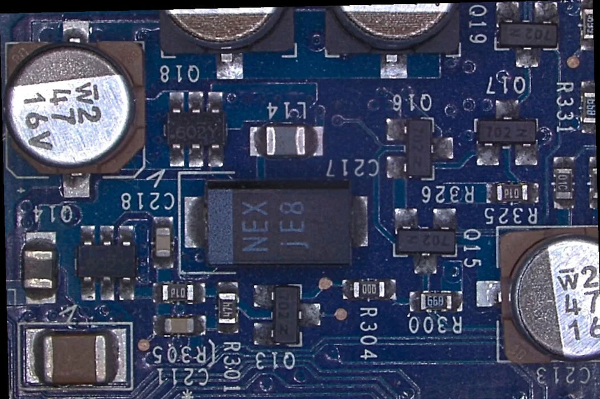

# ScopeCam

PCB-Annotationstool für Trinokular-Mikroskop. Streamt den Kameraeingang auf eine Zeichenfläche — Linien, Pfeile, Bemaßungen, Texte, Rechtecke und mehr direkt auf das Live-Bild zeichnen.



---

## Features

- **Live-Stream** via WebSocket → `<canvas>` (kein Lag)
- **Demo-Modus** — funktioniert ohne Kamera mit PCB-Testbild
- **Zeichenwerkzeuge** — Linie, Pfeil, Bemaßung, Rechteck, Kreis, Text, Freihand, Polylinie, Callout, Schnellmessung, Kalibrierung
- **KI-Integration** — OpenAI, Anthropic (Claude), Google (Gemini) annotieren das Board automatisch
- **Projektformat `.scopecam`** — gültiges PNG mit eingebetteten Metadaten (öffnet in jedem Bildeditor)
- **Server-seitiger File-Manager** — Dateien direkt im Browser verwalten
- **Tab-System** — mehrere Canvas-Ansichten, eigene History pro Tab
- **Timeline / Undo** — bis zu 100 Einträge, in Projektdatei gespeichert
- **Konsole** (`F12`) — 48 Befehle, Tab-Completion, KI-Aktionen direkt ausführen
- **Einrasten** — Raster, Hilfslinien, Objekt-Snap, PCB-Kanten-Snap (Beta)
- **Design-System** — 6 Themes (Dark, Midnight, Carbon, Light, Solarized, Nord)
- **Mobile-UI** — Pinch-Zoom, Touch-optimierte Werkzeugleiste

---

## Schnellstart

```bash
# Mit snap Docker (benötigt Gerätezugriff für /dev/video*)
docker --context default compose up -d --build
```

App läuft dann auf **http://localhost:8080**  
Dokumentation: **http://localhost:8080/docs.html**

> **Hinweis:** Docker Desktop (QEMU-VM) hat keinen Zugriff auf `/dev/video*` — immer den nativen Docker-Kontext (`--context default`) verwenden.

---

## Kamera-Unterstützung

| Gerät | Typ | Format |
|---|---|---|
| USB-Kamera (UVC) | Standard V4L2 | MJPG bis 1920×1080 @ 60 fps |
| HDMI-Receiver (Rockchip rk_hdmirx) | Multiplanar (MPLANE) | NV24, 1600×1200 @ 60 fps |
| Demo-Modus | — | Statisches PCB-Testbild |

Die Pipeline erkennt automatisch MPLANE- und MJPG-Unterstützung und wählt den optimalen Pfad.

---

## Werkzeuge

| Taste | Werkzeug |
|---|---|
| `S` | Auswahl |
| `H` | Hand / Pan |
| `L` | Linie |
| `A` | Pfeil |
| `D` | Bemaßung |
| `R` | Rechteck |
| `C` | Kreis |
| `T` | Text |
| `F` | Freihand |
| `P` | Polylinie |

Alle Shortcuts sind in **Einstellungen → Tastenkürzel** anpassbar.

---

## KI-Integration

Einstellungen → KI → Provider wählen (OpenAI / Anthropic / Google / Custom):

```
Provider  │ Endpunkt
──────────┼──────────────────────────────────────────
OpenAI    │ https://api.openai.com/v1
Anthropic │ https://api.anthropic.com
Google    │ https://generativelanguage.googleapis.com/v1beta
Custom    │ beliebiger OpenAI-kompatibler Endpunkt
```

Die KI sieht bei jeder Anfrage den aktuellen Canvas-Zustand + Live-Frame und kann Objekte erstellen, verschieben, löschen, Ebenen anlegen und Hilfslinien setzen.

**Extended Thinking** (Anthropic Claude / Google Gemini) aktivierbar in den KI-Einstellungen.

---

## Projektformat `.scopecam`

```
.scopecam = gültiges PNG
           + iTXt-Chunk "ScopeCam" mit JSON:
             { frame, canvasJSON, layers, guides, history }
```

Dateien öffnen in Paint.NET, Pinta und jedem anderen PNG-Editor (zeigt das Hintergrundbild). Metadaten bleiben erhalten.

---

## Stack

| Datei | Zweck |
|---|---|
| `main.py` | FastAPI-Backend: WebSocket-Stream, Settings-API, File-Manager, KI-Proxy |
| `static/index.html` | App-Shell |
| `static/modules/` | Frontend-Logik (33 Dateien, aus app.js aufgeteilt) |
| `static/style.css` | Dark-Theme + 5 weitere Designs |
| `static/docs.html` | Interaktive Dokumentation |
| `Dockerfile` | python:3.11-slim + ffmpeg + v4l-utils |
| `docker-compose.yml` | Port 8080, `/dev`-Mount, `privileged: true` |

### Backend-API

| Endpoint | Beschreibung |
|---|---|
| `WS /ws` | JPEG-Frame-Stream |
| `GET /api/settings` | Kamera-Einstellungen lesen |
| `POST /api/settings` | Kamera-Einstellungen schreiben |
| `GET /api/devices` | Verfügbare V4L2-Geräte |
| `GET /api/files?path=` | Verzeichnislisting |
| `POST /api/files/write?path=` | Datei speichern |
| `GET /api/files/read?path=` | Datei lesen |
| `POST /api/files/mkdir` | Ordner erstellen |
| `DELETE /api/files?path=` | Datei/Ordner löschen |
| `POST /api/files/rename` | Umbenennen |
| `GET /api/client-settings` | Client-Settings lesen |
| `POST /api/client-settings` | Client-Settings schreiben |
| `POST /api/ki_proxy` | KI-Proxy (Google CORS-frei) |

---

## Konsole (`F12`)

Terminal-Interface mit 48 Befehlen, Tab-Completion und Befehls-History:

```
list            — Alle Objekte auflisten
select C217     — Objekt nach Name auswählen
move #0 100 200 — Objekt per Index verschieben
create rect x=10 y=10 w=80 h=40 stroke=#ff0000
ki Beschrifte alle Kondensatoren
export svg
zoom 2
guide h 300
design midnight
eval canvas.getObjects().length
```

Vollständige Befehlsreferenz: **http://localhost:8080/docs.html#console**

---

## Entwicklung

```bash
# Abhängigkeiten (lokal, ohne Docker)
pip install fastapi uvicorn opencv-python-headless pyturbojpeg numpy httpx

# Starten
uvicorn main:app --reload --port 8080
```

Frontend: reines HTML/CSS/JS, kein Build-Schritt nötig. Fabric.js 5.3.0 via CDN.

---

## Lizenz

MIT
